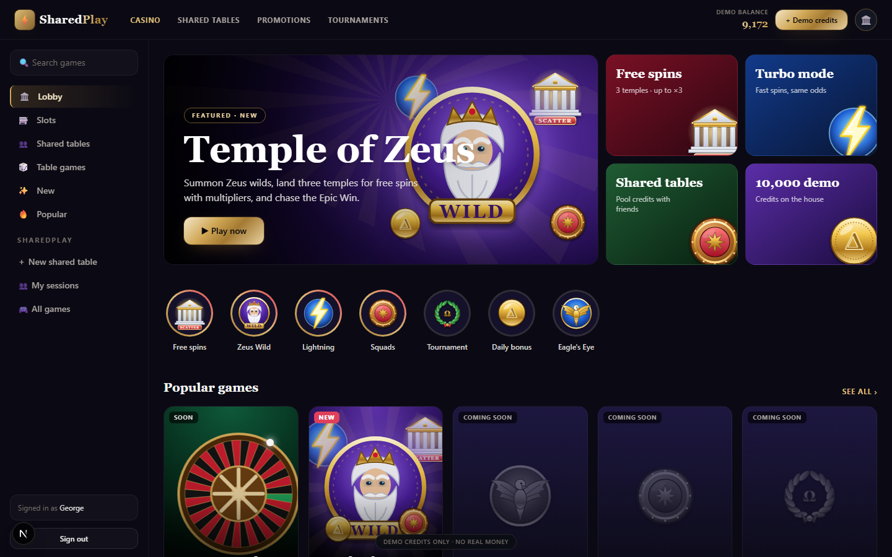
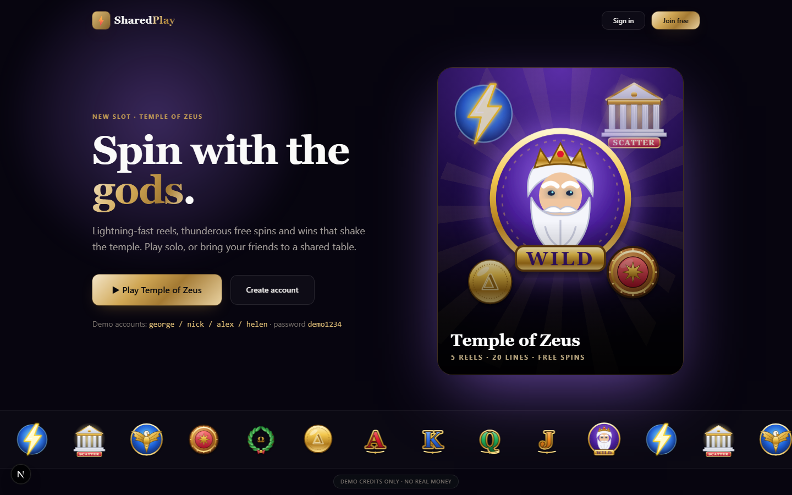
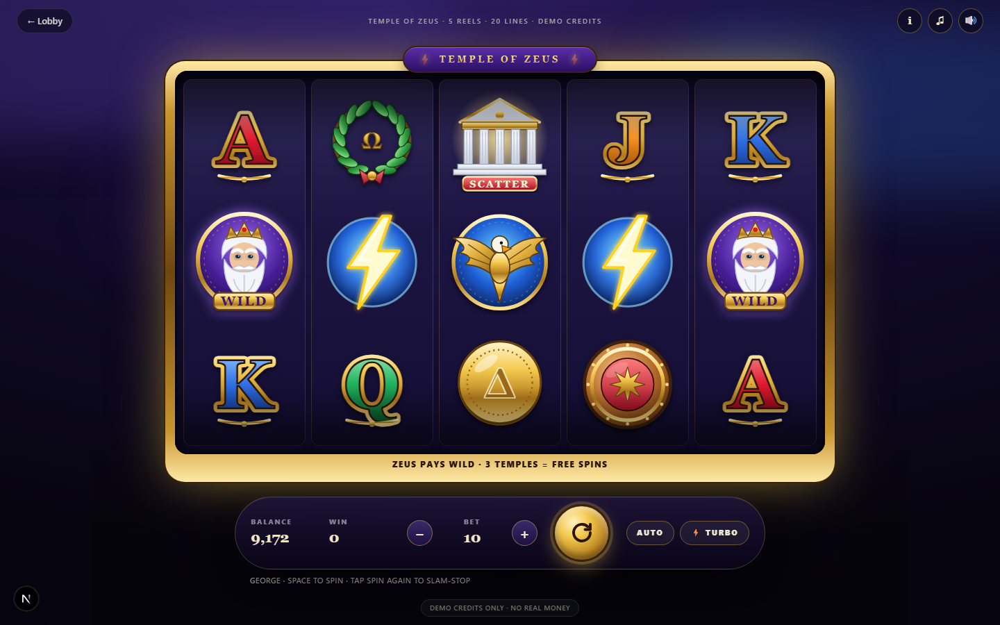
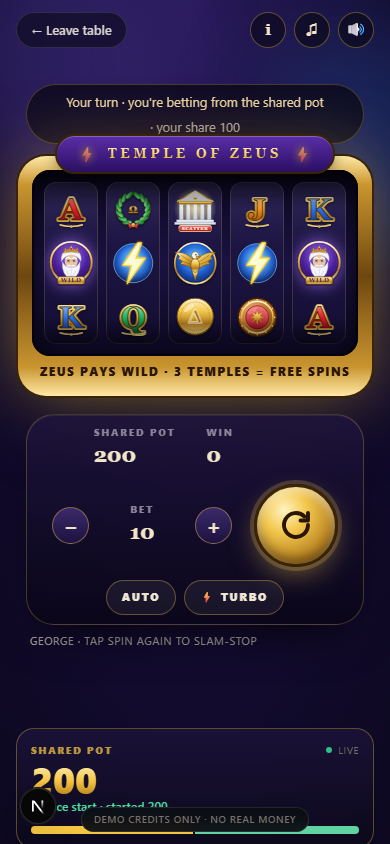

# SharedPlay Casino — Prototype



SharedPlay is a social-casino prototype where friends join a session, contribute demo
credits, and experience a shared game together. This repository contains the prototype
source and a runnable local demo; it is not a production gambling service.

| Landing | Game | SharedPlay on mobile |
|---|---|---|
|  |  |  |

**Version:** [0.2.1](../../releases/tag/0.2.1). **License:** All rights reserved;
see [LICENSE](LICENSE). The code is public to inspect, but this is not an open-source
license or permission to redistribute or build on it. Third-party package licenses
remain their own. The screenshots above show this project's UI; third-party visual
references are not distributed here.

[Download this prototype's 0.2.1 source ZIP](../../archive/refs/tags/0.2.1.zip).

**Demo credits only. No real-money deposits, withdrawals, crypto or payment processing.**
Nothing in this repository is a licensed gambling product; compliance, KYC, AML and tax
flows are *simulated visually* only.

The software is provided as is, without warranty of any kind; you use it at your own
risk.

Do not expose this demo to the public internet as-is. Set a unique `AUTH_SECRET` and
replace seeded demo credentials before any deployment; see `.env.example`.

> "Online gambling has digitized the casino, but largely kept the experience solitary.
> We're rebuilding the casino around groups."

---

## 1. Architecture

```
apps/web                      Next.js (App Router) + custom Node server + Socket.IO
  ├─ src/app/                 Pages: landing, login/signup, lobby, games, sessions, invite
  ├─ src/app/api/             7 REST route handlers: auth (signup, login, logout, me),
  │                           sessions (create, join), solo spin (see section 3)
  ├─ src/components/          Slot machine, shared table and site UI
  └─ server/                  Custom server: Next + Socket.IO in one process
       │                      (index.ts, socket.ts)
       └─ realtime/           Server-authoritative SharedPlay session hub: session
                              service (voting, settlement), state and views, locks,
                              presence, demo bot, responsible-gaming checks

packages/sharedplay           SharedPlay ENGINE (pure domain, no I/O, no framework)
  ownership · ledger hash chain · votes · control rotation · session rules

packages/games                GAME ENGINES (pure, deterministic, server-side RNG)
  GameEngine interface · Temple of Zeus · RTP simulator

packages/types                Shared TypeScript contracts (enums, views, socket events)

packages/db                   Prisma schema + migrations + seed (SQLite for the prototype)
```

Dependency rule (the B2B story is enforced by imports):

```
web  ──►  sharedplay  ──►  types          (SharedPlay never imports a game)
web  ──►  games       ──►  types          (games never import SharedPlay)
```

`sharedplay` and `games` communicate only through the `GameEngine` interface and
`GameEvent` stream (`BET_ACCEPTED`, `ROUND_RESULT`, `PAYOUT`, `BONUS_TRIGGERED`, …).
Long term this package boundary becomes the SharedPlay SDK/API that Casino A/B/C embed.

**Server authority.** The browser never decides balance, bankroll, payout, ownership or
settlement. Every mutating socket message and API route validates the session cookie,
re-reads state inside a Prisma transaction (SQLite WAL + per-session mutex), then emits
the new state to every participant.

## 2. Database schema

Canonical source: [`packages/db/prisma/schema.prisma`](packages/db/prisma/schema.prisma).

Entities: `User`, `Friendship`, `Squad`, `SquadMember`, `Game`, `SharedSession`,
`SessionParticipant`, `SessionLedgerEntry` (hash-chained), `GameRound`, `Invitation`,
`Vote`, `VoteResponse`, `ChatMessage`, `Reaction`, `SessionActivity`, `AnalyticsEvent`,
`ResponsibleGamingSettings`, `Notification`.

Conventions:

- All credit amounts are `Int` (demo credits). Ownership is stored in **basis points**
  (`ownershipBp`, 10000 = 100%) so the money path never touches floats.
- Status/type columns are `TEXT`, validated by the string unions in `@sharedplay/types`.
- Ledger entries carry `prevHash`/`entryHash` (SHA-256 chain) for an audit-style trail.

## 3. Routes in this snapshot

| Route | Purpose |
|---|---|
| `/` | Marketing landing — "The casino built for playing together." |
| `/login`, `/signup` | Demo-account authentication |
| `/lobby` | Casino lobby |
| `/games`, `/games/[slug]` | Game list and game screen |
| `/sessions`, `/sessions/new`, `/sessions/[id]` | SharedPlay sessions |
| `/invite/[token]` | Invitation landing |
| `/api/auth/*` | Signup, login, logout, current session |
| `POST /api/solo/spin` | Server-authoritative solo round |
| `/api/sessions`, `/api/sessions/join` | Session creation and join |

Socket.IO namespaces: single default namespace, rooms per session id.
Client→server events are declared in `@sharedplay/types` (`ClientToServerEvents`).

## 4. Scope

This snapshot includes the SharedPlay engine, a deterministic game engine,
server-side session handling, a lobby, a slot game, demo accounts, and desktop/mobile
UI work. The domain packages have automated tests. The broader social, analytics,
roulette, and regulated-casino features described as future architecture are not
implemented routes in this snapshot.

Out of scope on purpose: real deposits/withdrawals, payments, crypto, real KYC/AML/tax,
licences, VIP/affiliate systems, hundreds of games, sports, poker, native apps.

## 5. Running it

```bash
pnpm install
pnpm db:generate && pnpm db:migrate && pnpm db:seed
pnpm dev            # http://localhost:3000
pnpm typecheck && pnpm test
pnpm sim:rtp        # Temple of Zeus RTP simulator (prototype tuning)
```

Demo accounts — `george`, `nick`, `alex`, `helen` / password `demo1234`, each with
10,000 demo credits. Two browsers (or a normal + incognito window) exercise the full
SharedPlay loop.

Environment: see [`.env.example`](.env.example). `RNG_MODE=seeded` makes outcomes
reproducible for tests/scripted demos; normal play always uses `RNG_MODE=random`.

## 6. Randomness notice

Prototype-only. One centralized RNG (`packages/games/src/rng.ts`) produces every
outcome server-side; outcomes never depend on player identity, bet size or behaviour.
`RNG_MODE=seeded` exists for tests and the labelled investor demo sequence. This is not
regulation-grade RNG and the product is not offered for real money.

## 7. Future regulated architecture (documented, not built)

`JurisdictionConfig` (country, minimumAge, sharedPlayAllowed, taxRules,
responsibleGamingRules, gameRestrictions) keeps game logic jurisdiction-agnostic so
Greece → EU expansion is configuration, not a rewrite. Future money flow:
Player → KYC → deposit → licensed wallet → SharedPlay allocation → game → settlement →
tax/compliance → wallet → withdrawal. None of those systems exist in this prototype.
